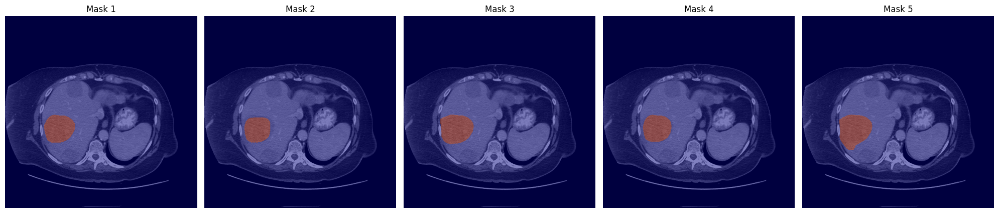
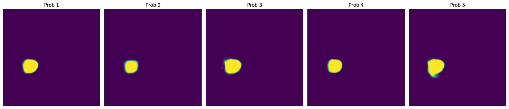
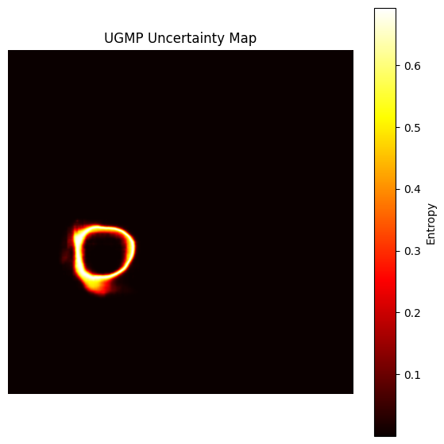
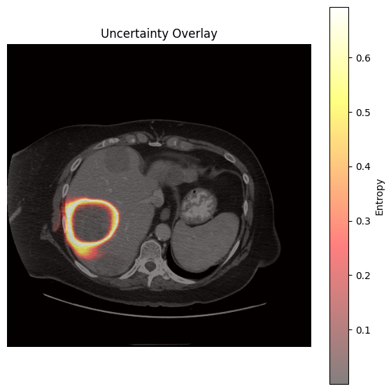

# MedSAM-U: UGMP Implementation

Implementation of the **Uncertainty-Guided Multi-Prompt (UGMP)** stage from the MedSAM-U research paper.

> **Research Internship Project — IEEE SMC Student Branch Chapter, KGEC**

MedSAM-U improves the reliability of medical image segmentation by using multiple prompt variations and uncertainty estimation. This repository contains an implementation of the UGMP stage, including multiple bounding-box generation, MedSAM inference, mask generation, probability maps, and entropy-based uncertainty visualization.

---

## 📌 Project Overview

MedSAM can perform medical image segmentation using a bounding-box prompt. However, small changes in the prompt can affect the resulting segmentation.

The UGMP approach addresses this by generating multiple perturbed bounding boxes and comparing their predictions.

### Pipeline

```text
Input Image
    │
    ▼
Initial Bounding Box
    │
    ▼
Perturbed Bounding Boxes
    │
    ▼
MedSAM Inference
    │
    ├── Mask 1
    ├── Mask 2
    ├── Mask 3
    ├── Mask 4
    └── Mask 5
    │
    ▼
Probability Maps
    │
    ▼
Mean Probability
    │
    ▼
Entropy
    │
    ▼
Uncertainty Map
```

---

## 🔬 What I Implemented

- Multiple bounding-box generation
- MedSAM inference for each prompt
- Multiple segmentation masks
- Probability-map generation
- Mean probability calculation
- Entropy-based uncertainty estimation
- Uncertainty-map visualization
- Uncertainty overlay on the input image

---

## 📁 Project Structure

```text
MedSAM-U-UGMP/
│
├── UGMP.ipynb
├── README.md
├── requirements.txt
├── .gitignore
│
├── docs/
│   ├── MedSAM-U_Research_Report.pdf
│   └── MedSAM-U_Presentation.pdf
│
└── results/
    ├── generated_boxes.png
    ├── segmentation_masks.png
    ├── probability_map.png
    ├── uncertainty_map.png
    └── uncertainty_overlay.png
```

---

## ⚙️ Requirements

The implementation was developed using **Google Colab with GPU support**.

Install the dependencies with:

```bash
pip install -r requirements.txt
```

The project also requires the official MedSAM repository and model checkpoint.

**MedSAM:**  
https://github.com/bowang-lab/MedSAM

The model checkpoint is not included in this repository because of its large file size.

---

## ▶️ Running the Project

Clone the repository:

```bash
git clone https://github.com/Infrazor/MedSAM-U-UGMP.git
cd MedSAM-U-UGMP
```

Install the dependencies:

```bash
pip install -r requirements.txt
```

Set up the official MedSAM repository and download the required model checkpoint.

Then open:

```text
UGMP.ipynb
```

Run the notebook cells sequentially.

---

## 📊 Results

The UGMP implementation generated multiple segmentation predictions using
slightly different bounding-box prompts. The resulting predictions were
then used to study the variation in the segmentation and estimate
pixel-level uncertainty.

### Segmentation Masks

Five segmentation masks were generated, one for each perturbed bounding-box
prompt.



The masks show how the predicted segmentation changes when the bounding-box
prompt is slightly modified.

### Probability Maps

A probability map was generated for each of the five predictions.



These probability maps provide the prediction information used for the
subsequent uncertainty calculation.

### Uncertainty Map

The probability information from the multiple predictions was used to
calculate an entropy-based uncertainty map.



Higher uncertainty indicates regions where the predictions are less
consistent across the different prompt variations.

### Uncertainty Overlay

The uncertainty map was also visualized over the original medical image.



The uncertainty is mainly visible around regions where small changes in the
prompt can cause changes in the predicted segmentation, particularly near
the target boundary.
---

## 📐 Entropy-Based Uncertainty

For a binary prediction with probability `p`:

```text
H(p) = -p log(p) - (1-p) log(1-p)
```

Lower entropy indicates a more confident prediction, while higher entropy indicates greater uncertainty.

---

## ⚠️ Scope and Limitations

This repository focuses on the **UGMP implementation**.

It does not claim to reproduce the complete MedSAM-U framework, including:

- Complete MPA-MedSAM training
- Complete UGPA implementation
- Full training pipeline
- Full benchmark evaluation
- All quantitative experiments reported in the paper

The repository should therefore be considered an implementation and study of the UGMP stage.

---

## 📚 References

**MedSAM-U:**  
*Uncertainty-Guided Auto Multi-Prompt Adaptation for Reliable MedSAM*

Research paper:  
https://arxiv.org/abs/2409.00924

**MedSAM:**  
*Segment Anything in Medical Images*

Official MedSAM repository:  
https://github.com/bowang-lab/MedSAM

---

## Internship

**IEEE SMC Student Branch Chapter**  
**Kalyani Government Engineering College**

Research Internship Programme 2026

**Intern:** Sudhanshu Kumar
